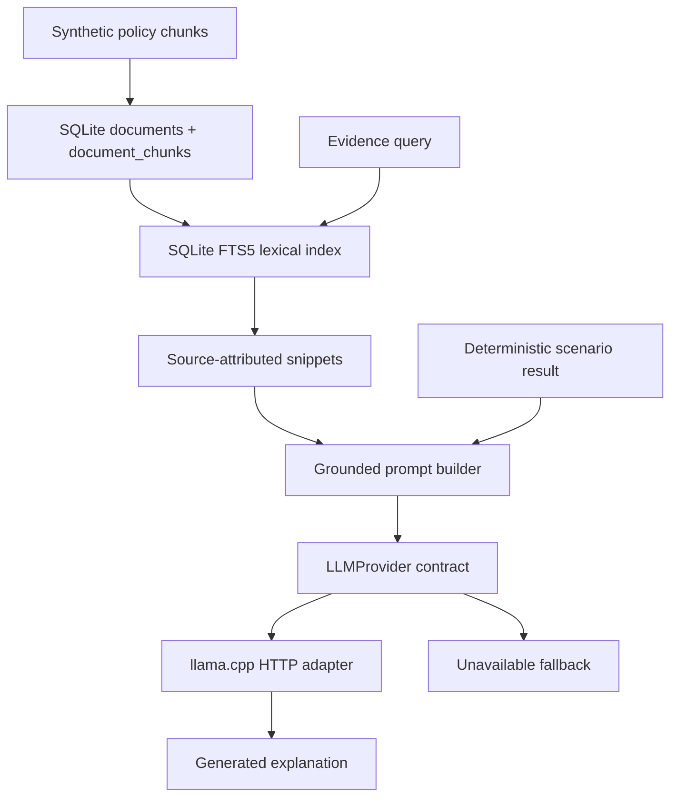

# AI and RAG Architecture

## Retrieval path actually implemented

## Deterministic code

- SQLite stores document metadata/chunks and scenario records.
- FTS5 performs lexical token matching.
- `core/analytics.py` calculates land-use totals, percentages and period changes.
- `core/simulation.py` calculates scores, ranking, allocation and baseline/scenario values.
- The API computes and persists the SHA-256 result checksum.
- The AI layer receives the scenario result; it does not calculate or mutate it.

## AI-generated explanation

- Provider: `LlamaCppProvider`.
- Runtime: local llama.cpp HTTP server.
- Model format: GGUF; workspace contains `SmolLM2-1.7B-Instruct-Q4_K_M.gguf`.
- Endpoint: configured local `/v1/chat/completions` endpoint.
- Prompt: includes the policy question, retrieved source IDs/snippets, simulation JSON and assumptions.
- Guardrail: retrieved text is explicitly treated as untrusted data, not instructions.
- Fallback: if health is false or generation fails, status is `unavailable` and the supplied deterministic result is returned unchanged.

## Not implemented

- Embeddings.
- Vector index.
- Hybrid/semantic ranking.
- PDF/HTML extraction.
- Structured output schema validation.
- Citation validation against retrieved source IDs.
- Conflict resolution between sources.

## Evidence captured for this package

During the live browser run, the local LLM was not running. The actual UI reported: `AI insight unavailable because the local LLM runtime is offline.` This is captured in `decision_insight_offline_fallback.png` and is the only AI result claimed in this package.
