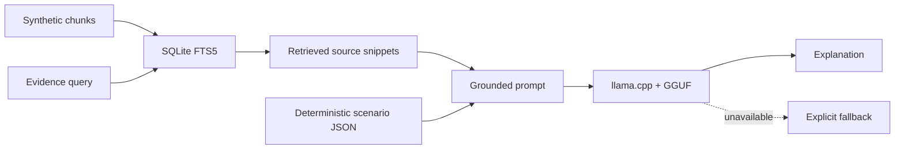

# AI/RAG Pipeline Diagram

```mermaid
flowchart LR
    D[Synthetic chunks] --> F[SQLite FTS5]
    Q[Evidence query] --> F
    F --> E[Retrieved source snippets]
    E --> P[Grounded prompt]
    R[Deterministic scenario JSON] --> P
    P --> L[llama.cpp + GGUF]
    L --> G[Explanation]
    L -. unavailable .-> U[Explicit fallback]
```

Current retrieval is lexical FTS5. Embeddings, vector retrieval and citation validation are future work.
