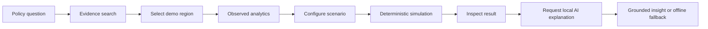

# Application Workflow Diagram

```mermaid
flowchart LR
    Q[Policy question] --> E[Evidence search]
    E --> R[Select demo region]
    R --> A[Observed analytics]
    A --> C[Configure scenario]
    C --> S[Deterministic simulation]
    S --> I[Inspect result]
    I --> X[Request local AI explanation]
    X --> D[Grounded insight or offline fallback]
```

This represents the implemented UI flow. The geography step currently presents observed KPIs and a map placeholder rather than a real interactive map.
