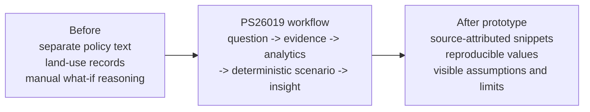

# Before vs After Workflow

```mermaid
flowchart LR
    B[Before\nseparate policy text\nland-use records\nmanual what-if reasoning] --> W[PS26019 workflow\nquestion -> evidence -> analytics\n-> deterministic scenario -> insight]
    W --> A[After prototype\nsource-attributed snippets\nreproducible values\nvisible assumptions and limits]
```

This is a workflow comparison, not a measured impact claim. No field study or user-performance metric is included in the current codebase.
