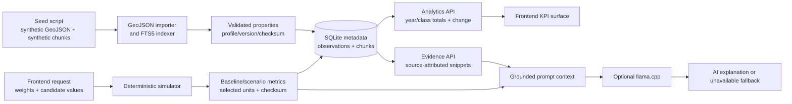

# Actual Data Flow

## Implemented sequence

1. `scripts/seed_demo.py` creates/registers a synthetic GeoJSON dataset and one synthetic policy document.
2. `core/data/catalog.py` validates a non-empty `FeatureCollection`, Polygon geometry and required properties; it records dataset/version/region/observation metadata and file checksum.
3. `core/evidence.py` indexes synthetic chunks in SQLite FTS5 with source metadata.
4. `/api/evidence` returns lexical matches with source ID, title, source, chunk ID and snippet.
5. `/api/analytics` reads land-use observations and computes deterministic totals, percentages and changes.
6. The frontend sends scenario candidate factors and weights to `/api/scenarios/run`.
7. `core/simulation.py` filters eligible agriculture candidates, scores/ranks them, allocates the requested area and returns baseline/scenario totals.
8. The API persists scenario/run/result/audit data and returns a result checksum.
9. `/api/insights` retrieves optional evidence and passes evidence plus scenario results to `ai/synthesis.py`.
10. `ai/synthesis.py` calls configured llama.cpp when available; otherwise it returns an explicit unavailable status without changing numerical results.

## Not in the current flow

- Public/government data download.
- PDF/HTML extraction.
- Embedding generation or semantic retrieval.
- Spatial calculations from geometry.
- Browser rendering of GeoJSON or affected geometries.
