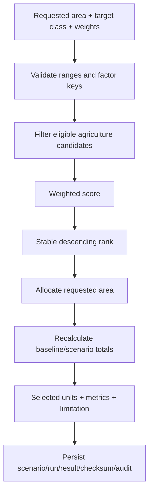

# Scenario Simulation Pipeline

```mermaid
flowchart TD
    P[Requested area + target class + weights] --> V[Validate ranges and factor keys]
    V --> F[Filter eligible agriculture candidates]
    F --> SC[Weighted score]
    SC --> R[Stable descending rank]
    R --> AL[Allocate requested area]
    AL --> M[Recalculate baseline/scenario totals]
    M --> OUT[Selected units + metrics + limitation]
    OUT --> STORE[Persist scenario/run/result/checksum/audit]
```

Formula implemented in `core/simulation.py`:

`urban_proximity*w1 + population_pressure*w2 + infrastructure_access*w3 - environmental_constraint*w4`
