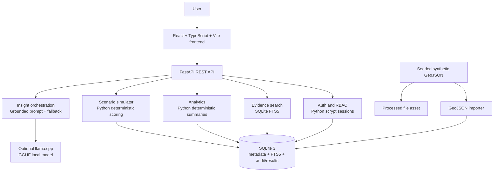

# Actual System Architecture

## Actual components

- **Frontend:** `frontend/src/main.tsx` and `frontend/src/styles.css`.
- **API:** `backend/app.py` with six implemented routes.
- **Configuration:** `backend/config.py`.
- **Security:** `backend/security.py`.
- **Database:** `core/database/connection.py`, `migrator.py`, and three SQL migrations.
- **Evidence:** `core/evidence.py`; SQLite FTS5 lexical search.
- **Analytics:** `core/analytics.py`.
- **Simulation:** `core/simulation.py`.
- **Data ingestion:** `core/data/catalog.py`; small prepared GeoJSON importer.
- **AI:** `ai/providers/llama_cpp.py` and `ai/synthesis.py`.
- **Assets:** GeoJSON and local GGUF model remain file-based; SQLite stores metadata and results.

## Boundaries and limitations

The current frontend does not render a real GIS map. The simulator receives candidate factor values in the scenario request rather than deriving them from stored geometry. The local LLM explains retrieved evidence and supplied simulation results; it does not calculate authoritative values.
